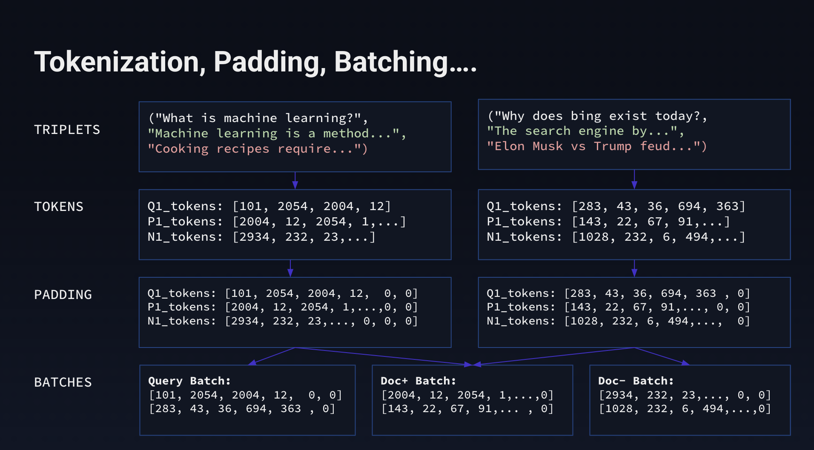
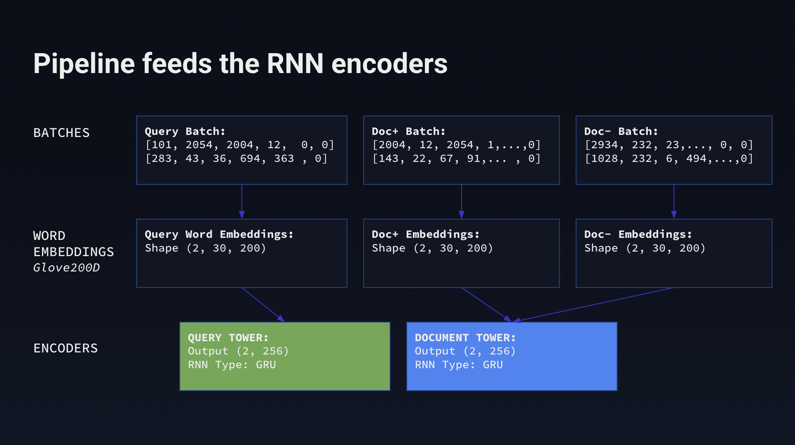
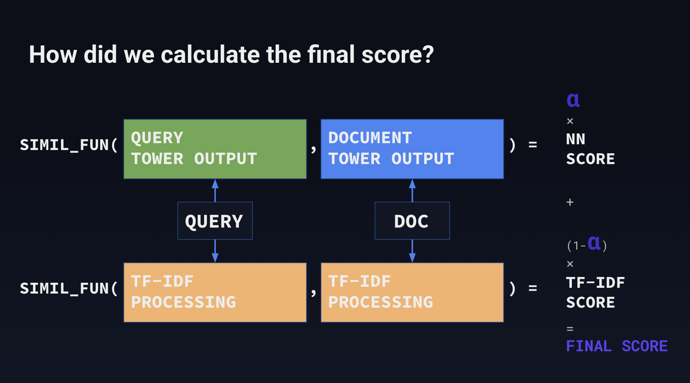
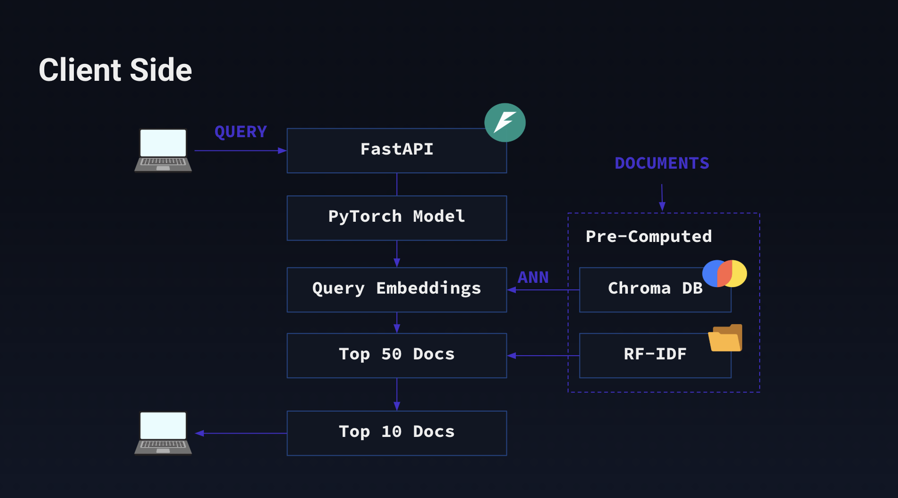

# Two Tower Hybrid Search Engine

This project implements a powerful hybrid search engine that combines the strengths of traditional keyword-based search (TF-IDF) and modern semantic search using a dual-encoder (Two Tower) neural network architecture. The goal is to provide highly relevant search results by understanding both the lexical and semantic meaning of user queries and documents.

The deployed application allows users to search a corpus of documents, and fine-tune the weighting between the TF-IDF and semantic search scores to explore the results.


## Business Objective

In today's data-driven world, users expect intelligent and intuitive search experiences. Simple keyword matching often fails to capture the user's true intent, leading to irrelevant results. This project aims to solve this by providing a search engine that:

- **Understands meaning:** Goes beyond keywords to understand the semantic context of queries.
- **Delivers relevance:** Returns documents that are conceptually related to the user's query, even if they don't share the same keywords.
- **Is user-friendly:** Provides a simple interface for searching and exploring results.
- **Is tunable:** Allows for adjusting the importance of keyword vs. semantic matching.

This technology can be applied to various domains, such as e-commerce, customer support, document management, and knowledge bases, to significantly improve information retrieval and user satisfaction.

## Backend Architecture

The backend is responsible for training the semantic search model and serving the search results. It's built with Python, PyTorch, and popular data science libraries.

### 1. Data Processing and Word Embeddings

Before training the model, the text data goes through a series of preprocessing steps:

-   **Tokenization:** Breaking down text into individual words or subwords.
-   **Padding:** Ensuring all sequences in a batch have the same length for efficient processing by the neural network.
-   **Batching:** Grouping multiple samples to be processed together.
-   **Word Embeddings:** Converting tokens into dense vector representations. This project uses pre-trained GloVe embeddings to leverage existing knowledge of word semantics.



### 2. The Two-Tower Model and Triplet Loss

The core of the semantic search is a Two-Tower model, which consists of two separate encoders (towers): one for queries and one for documents. These encoders are based on Recurrent Neural Networks (RNNs), specifically GRUs (Gated Recurrent Units).

The model is trained using a **triplet loss function**. For each "anchor" (a query), we select a "positive" document (a relevant one) and a "negative" document (an irrelevant one). The training objective is to minimize the distance between the anchor and positive embeddings while maximizing the distance between the anchor and negative embeddings. This pushes semantically similar items closer together in the embedding space.



### 3. Hybrid Scoring

To provide the final ranking of documents, the system calculates a hybrid score that combines the TF-IDF score and the semantic similarity score.

-   **TF-IDF (Term Frequency-Inverse Document Frequency):** This score measures the importance of a word in a document relative to a collection of documents (corpus). It's effective for matching keywords.
-   **Semantic Score:** This is the cosine similarity between the query embedding and the document embedding, generated by the Two-Tower model.

The final score is a weighted average of these two scores, which can be tuned by the user in the frontend.



## Frontend Architecture

The frontend provides a user interface for interacting with the search engine. It is built with FastAPI and communicates with the backend to retrieve search results.

### 1. System Architecture

The frontend architecture consists of:

-   **FastAPI Server:** A lightweight and fast web framework for building the API that the user interface interacts with.
-   **Model Loading:** The trained Two-Tower model and TF-IDF vectorizer are loaded into memory for fast inference.
-   **Vector Database:** Document embeddings are pre-computed and stored in a ChromaDB vector database. This allows for efficient similarity searches.
-   **Precomputed TF-IDF:** The TF-IDF vectors for all documents are also precomputed and stored.



### 2. Retrieval Process

When a user enters a query:
1.  The query is embedded using the query encoder tower.
2.  An Approximate Nearest Neighbor (ANN) search is performed on the ChromaDB to quickly retrieve the top 50 most semantically similar documents.
3.  The TF-IDF scores are calculated for these 50 documents.
4.  The hybrid score is computed for each document.
5.  The documents are re-ranked based on the hybrid score, and the top 10 are returned to the user.

## User Guide

Follow these steps to set up and run the project.

### Step 1: Clone the repository and create a virtual environment

```bash
git clone <repository-url>
cd TwoTowerMLRetrieval
python -m venv venv
source venv/bin/activate
pip install -r requirements.txt
```

### Step 2: Download the dataset

Create the `data` and `artifacts` directories. Then, run the `download_dataset.ipynb` notebook to download the MS Marco dataset.

```bash
mkdir data artifacts
```
Now, open and run the notebook `notebooks/download_dataset.ipynb`.

### Step 3: Train the Model

You can configure the training process by editing `backend/config.json`. The default parameters are set for the MS Marco dataset.

To start training, run the following command from the root directory:

```bash
python backend/main.py
```

This will train the Two-Tower model, save the model artifacts, document embeddings, and TF-IDF vectorizer in the `artifacts` directory. The training progress can be monitored using Weights & Biases (you will need a free account).

### Step 4: Set up the Vector Database

Before running the frontend, you need to populate the ChromaDB vector database with the document embeddings.

1.  Update the `ARTIFACTS_PATH` in `frontend/config.json` to point to the latest run directory inside `artifacts`. For example:
    ```json
    {
        "ARTIFACTS_PATH": "../artifacts/run-20250619_232020"
    }
    ```
2.  Run the `notebooks/save_to_chromaDB.ipynb` notebook to create and populate the vector database.

### Step 5: Run the Application with Docker

The easiest way to run the application is with Docker Compose.

```bash
docker-compose up --build
```

This will build the Docker image and start the FastAPI application. You can then access the search engine at `http://localhost:8888`. 